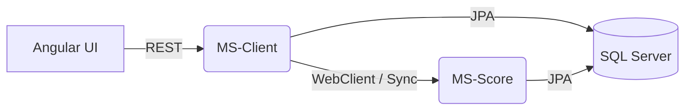
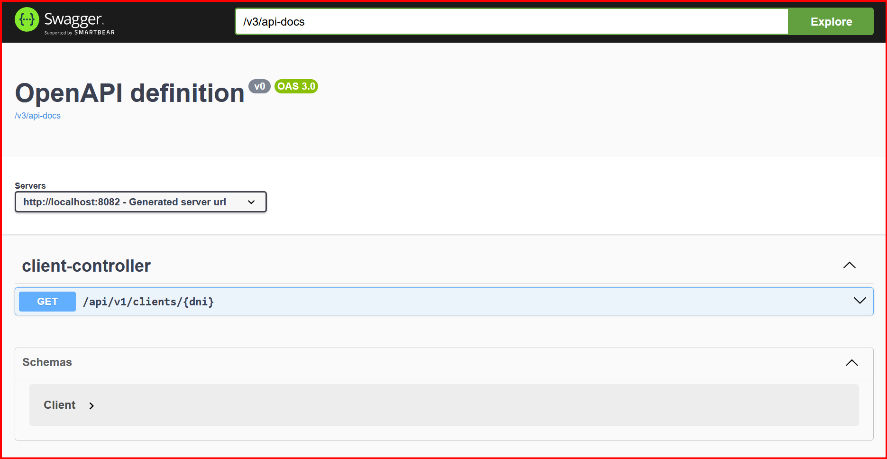

```
(\ (\
( • •)  
━∪∪━━━━ 
ᵇʸ ᴬˡᵉᶠᵘᵉⁿᵗᵉˢ
```
# Fintech Lending Ecosystem
     𖥔   


Ecosistema de microservicios de grado empresarial para la evaluación de riesgos crediticios en tiempo real. Este proyecto demuestra una arquitectura desacoplada, comunicación sincrónica de alto rendimiento y un frontend moderno con reactividad basada en Signals.

---

## Arquitectura del Sistema

El proyecto aplica **Arquitectura Hexagonal (Ports & Adapters)** y principios de **DDD (Domain-Driven Design)** para garantizar que la lógica de negocio sea independiente de la tecnología.

### Flujo de Comunicación (Sin Broker)
Para este caso de uso, se optó por una comunicación **sincrónica directa** para obtener respuestas inmediatas:
`Usuario` ➔ `Angular WebApp` ➔ `MS-Client (Port 8082)` ➔ **[WebClient]** ➔ `MS-Score (Port 8081)` ➔ `SQL Server`




## Highlights Técnicos
Backend (Java 21 + Spring Boot 3.4)

* Virtual Threads: Optimización del manejo de peticiones sincrónicas mediante hilos virtuales de Java 21.
* WebClient (Reactive Stack): Utilizado de forma bloqueante deliberada para orquestar datos enriquecidos.
* Resilience4j: Implementación de Circuit Breaker para evitar fallos en cascada si el servicio de Score no responde.
* SOLID & Clean Code: Separación estricta de Dominios, Casos de Uso y Adaptadores.

Frontend (Angular 20)

* Zoneless Change Detection: Eliminación de Zone.js para un rendimiento superior.
* Signals: Gestión de estado reactiva y granular.
* Standalone Components: Arquitectura moderna sin NgModules.
* Tailwind CSS v4: Diseño profesional con utilidades de última generación.

## Demo Visual

#### Dashboard de Consulta

Interfaz reactiva mostrando score enriquecido.

#### Documentación OpenAPI (Swagger)

Contratos de API documentados.


## Guía de Inicio Rápido

#### Requisitos

* Docker Desktop
* JDK 21
* Node.js 20+

#### Steps

1. Clonar y Compilar
```Bash
git clone https://github.com/ale-fuentes-ar/fintech-lending-ecosystem.git
cd fintech-lending-ecosystem
mvn clean package -DskipTests
```
  

2. Levantar Infraestructura
```Bash
docker compose up -d
```

3. Ejecutar Frontend
```Bash
cd web-app
npm install
npm start
```

---

# Troubleshooting

## Docker

### Verificar SQL Server

Utilizando powershell

```bash
docker exec -it fintech-db find /opt -name "sqlcmd"
# saida
/opt/mssql-tools18/bin/sqlcmd
```


```bash
docker exec -it fintech-db /opt/mssql-tools18/bin/sqlcmd -S localhost -U sa -P 'rooT123!' -C -d master -Q "SELECT * FROM clients;"
```

> ☕︎ ˖ NOTA : to insert a record
>
>    ```bash
>    docker exec -it fintech-db /opt/mssql-tools18/bin/sqlcmd -S localhost -U sa -P 'rooT123!' -C -d master -Q "INSERT INTO clients (dni, full_name, income) VALUES ('12345', 'Alejandro Fuentes', 5000.00);"
>    ```
 
 
## Autor

Alejandro Fuentes
LinkedIn
GitHub


---

Este proyecto fue desarrollado siguiendo los estándares de la industria para arquitecturas distribuidas y resiliencia de software.


